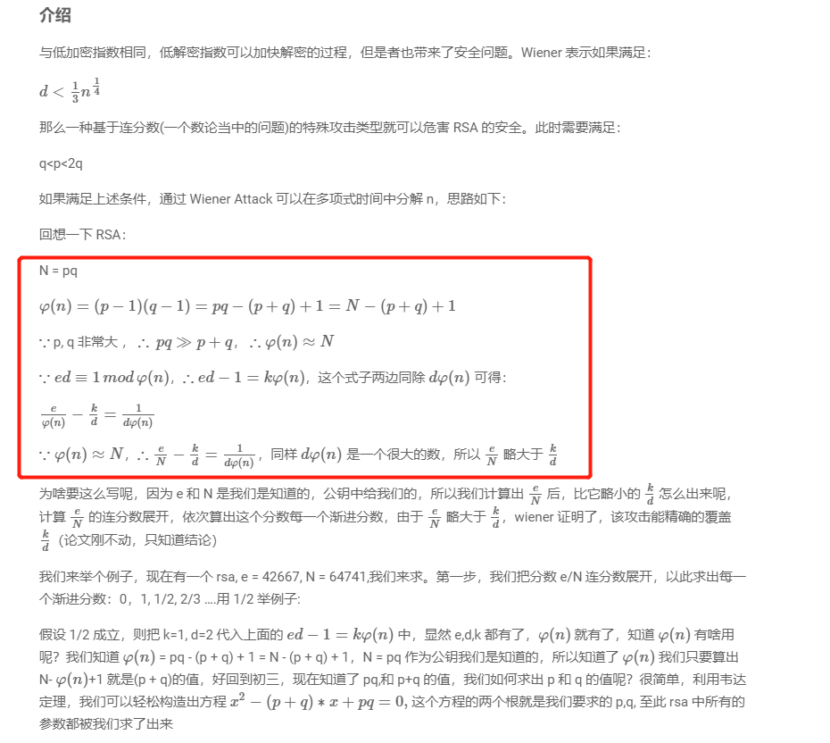

## 0x001 RSA加密算法

C = $M ^ e$ mod n

M = $C ^ d$ mod n

其中C代表密文，M代表明文

## 0x002 RSA解密方式1-已知公钥或模数n和指数e

### 大数分解

要想获取私钥，首先需要对公钥的模数进行大数分解，分解成两个大素数。

大数分解有很多种方式，这里列举三种：
1. 通过在线工具 **http://www.factordb.com/** 
2. 离线工具 **cado-nfs**
    ```
    ./cado-nfs.py （十进制数）
    ```
3. python3模块（pip3 install factordb-pycli）

### 计算私钥d

当知道n、e、q、p后，即可计算出私钥d

因为 **$\varphi$(n) = (q - 1) * (p - 1)**， **d * e = 1 mod $\varphi$(n)**

所以 **d为e关于f(n)的乘法逆元**， 通过求逆元的方式即可获取 **d** 值。

可通过python3 gmpy2库计算

```
rsa_d = gmpy2.invert(rsa_e, phi_n)
```

## 0x003 RSA解密方式2-已知n、e、dq或dp


根据基本公式

**$\varphi$(n) = (p - 1) * (q - 1)**

**d * e $\equiv$ 1 mod $\varphi$(n)**

**dp $\equiv$ d mod (p - 1)**

**dq $\equiv$ d mod (q - 1)**

可以推导出：

**dp * e = X * (p - 1) + 1**

其中

**X $\in$ (0, e)**

**dp < p - 1**

根据上述公式可知，只需遍历 **X**，就能求出 **(p - 1)**，得到 **p** 后且能被 **n** 整除，就能求出 **d**。由于 **dp * e = X * (p - 1) + 1** ，所以就有 **dp * e mod X = 1**。

脚本如下：
```
for i in range(1, e):
    if e * dp % i == 1:
        p = (e * dp - 1) // i + 1
        if n % p != 0:
            continue
        q = n // p
        phi_n = (p - 1) * (q - 1)
        d = gmpy2.invert(e, phi_n)
```

## 0x004 RSA解密方式3-已知dq、dp、p、q

根据公式

m1 = $c ^ {dp}$ mod p

m2 = $c ^ {dq}$ mod q

u = $q ^ -1$ mod p

M = (((m1 - m2) * u) mod p) * q + m2


可直接通过dp、dq、p、q解密获取明文

1. 计算 q mod p 的逆元 u
2. 计算 m1 = $c ^ {dp}$ mod p
3. 计算 m2 = $c ^ {dq}$ mod q
4. 求得 M = (((m1 - m2) * u) mod p) * q + m2

## 0x005 RSA解密方式4-共模攻击

已知 **e1**、 **e2**、 **n**、 **c1**、 **c2**，并且 **e1** 和 **e2** 互质，当 **n** 不变的情况下，可以不用知道 **d1**、 **d2**，直接解出明文

根据公式

**gcd(e1,e2) = 1**

**e1\*s1 + e2\*s2 = 1**

**c1 = $M ^ {e1}$ % n, c2 = $M ^ {e2}$ % n**

可得公式

**M = $c1 ^ {s1}$ * $c2 ^ {s2}$**

通过扩展欧几里德算法，我们可以得到该式子的一组解（s1, s2），代入公式即可解出明文。

## 0x006 RSA解密方式5-低加密指数

根据公式

C = $M ^ e$ mod n

可得

M = $\sqrt[3]{C + k * n}$

如果 **e** 过小（一般为3），则可以通过暴破 **k** 的方式获取明文

## 0x007 RSA解密方式5-低解密指数

原理太难懂。。。下面的图片以及原理都是搬运过来的。。。

Wiener Attack原理：



连分数和渐进分数


个人理解：


上面的等式应该比较容易理解，就是等式右边的分母很大，作为整体很小，意味着等式左边的减数和被减数的差距很小很小，并且可以通过被减数的连分数求解不断逼近它本身的一个渐进分数，因此可能会存在某个渐进分数可以满足减数的要求；

当然按照求解的渐进分数的分子分母分别对应减数的分子分母，因此从头将所有的渐进分数的分子分母求解出来。

在rsa中， φ(n)= pq - (p + q) + 1 = N - (p + q) + 1，N = pq ，其中p和q都是素数，因此可以推出 φ(n)和N之间的表达式。

## 0x008 OPENSSL相关命令

解析公钥证书：
```
openssl rsa -pubin -text -modulus -in warmup -in pub.key
```

解密加密文本可通过openssl的命令获得明文：
```
openssl rsautl -decrypt -in flag.enc -inkey private.pem
```

## 0x009 数学基础公式

1. 互推公式
   
   **a = k * b + p**
   
   **a mod b = p**

2. 如果有 **a * b $\equiv$ 1 mod c**
    
    则可推出 **a * b mod c = 1** 
    
    已知c、a或b的其中一个，则可以通过求逆元的方式获取a或b中的另一个。

## 0x0010 综合解密脚本

见附件：rsa.py