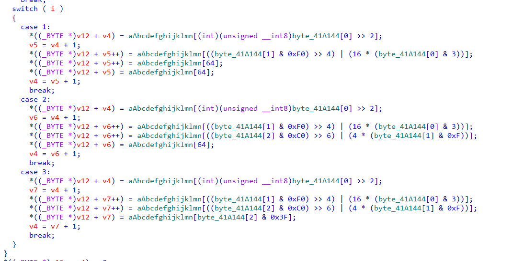
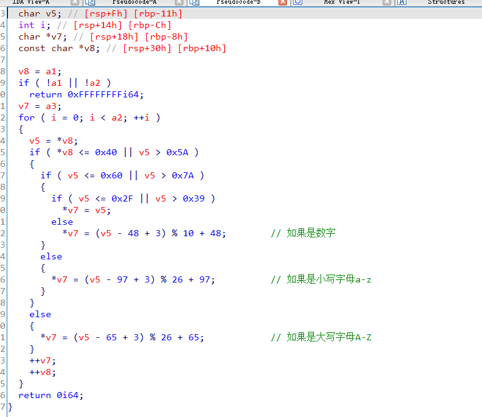

## 0x001 BASE64编码

> 码表：ABCDEFGHIJKLMNOPQRSTUVWXYZabcdefghijklmnopqrstuvwxyz0123456789+/=

**算法特征**



```
_BYTE *__cdecl sub_401000(int a1, int a2)
{
  int v2; // eax
  int v3; // esi
  size_t v4; // ebx
  _BYTE *v5; // eax
  _BYTE *v6; // edi
  int v7; // eax
  _BYTE *v8; // ebx
  int v9; // edi
  int v10; // edx
  int v11; // edi
  int v12; // eax
  int i; // esi
  _BYTE *result; // eax
  _BYTE *v15; // [esp+Ch] [ebp-10h]
  _BYTE *v16; // [esp+10h] [ebp-Ch]
  int v17; // [esp+14h] [ebp-8h]
  int v18; // [esp+18h] [ebp-4h]

  v2 = a2 / 3;
  v3 = 0;
  if ( a2 % 3 > 0 )
    ++v2;
  v4 = 4 * v2 + 1;
  v5 = malloc(v4);
  v6 = v5;
  v15 = v5;
  if ( !v5 )
    exit(0);
  memset(v5, 0, v4);
  v7 = a2;
  v8 = v6;
  v16 = v6;
  if ( a2 > 0 )
  {
    while ( 1 )
    {
      v9 = 0;
      v10 = 0;
      v18 = 0;
      do
      {
        if ( v3 >= v7 )
          break;
        ++v10;
        v9 = *(v3++ + a1) | (v9 << 8);
      }
      while ( v10 < 3 );
      v11 = v9 << (8 * (3 - v10));
      v12 = 0;
      v17 = v3;
      for ( i = 18; i > -6; i -= 6 )
      {
        if ( v10 >= v12 )
        {
          *(&v18 + v12) = (v11 >> i) & 0x3F;
          v8 = v16;
        }
        else
        {
          *(&v18 + v12) = 64;
        }
        *v8++ = byte_407830[*(&v18 + v12++)];
        v16 = v8;
      }
      v3 = v17;
      if ( v17 >= a2 )
        break;
      v7 = a2;
    }
    v6 = v15;
  }
  result = v6;
  *v8 = 0;
  return result;
}
```

## 0x002 整数排序算法

```
int __cdecl sub_4010F0(int a1, int a2, int a3)
{
  int result; // eax
  int i; // esi
  int v5; // ecx
  int v6; // edx

  result = a3;
  for ( i = a2; i <= a3; a2 = i )
  {
    v5 = 4 * i;
    v6 = *(4 * i + a1);
    if ( a2 < result && i < result )
    {
      do
      {
        if ( v6 > *(a1 + 4 * result) )
        {
          if ( i >= result )
            break;
          ++i;
          *(v5 + a1) = *(a1 + 4 * result);
          if ( i >= result )
            break;
          while ( *(a1 + 4 * i) <= v6 )
          {
            if ( ++i >= result )
              goto LABEL_13;
          }
          if ( i >= result )
            break;
          v5 = 4 * i;
          *(a1 + 4 * result) = *(4 * i + a1);
        }
        --result;
      }
      while ( i < result );
    }
LABEL_13:
    *(a1 + 4 * result) = v6;
    sub_4010F0(a1, a2, i - 1);
    result = a3;
    ++i;
  }
  return result;
}
```

## 0x003 移位加密



对数字、大小写字母进行移位加密，其中的 +3 为向右移三位