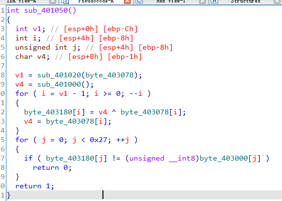

## 0x001 异或算法

### 示例一

算法内容



该算法中，输入的字符串从最后一位开始，每一位都与v4进行了异或运算，并将结果保存至另一个数组内。

进入循环前先初始化v4，之后在循环中，每次v4参加完运算后，会被赋值为与v4进行异或运算的数值。

```
v4 = 4
for i in range(len(table1)-1, -1, -1):
    flag[i] = v4 ^ table1[i]
    v4 = flag[i]
```